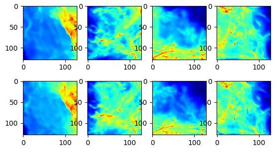
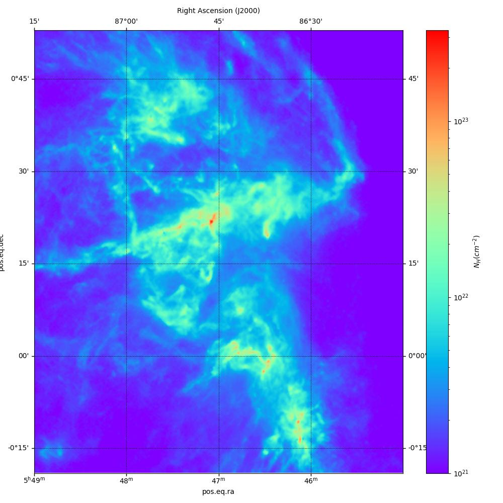

#  POLARIS - Core
*Author: Zack Ribeiro*

*This code is written as part of a PhD conducted between 2025 to 2028 at IPAG (Institut de Planétologie et d’Astrophysique de Grenoble), France.*

This repository provides tools to easily train, manage, and use neural networks.
It also includes functionality to:
- Predict direct observations (.fits files).
- Compute emission maps for molecules.
- Load, use, and group datacube simulations.
- Generate a variety of plots (simulations, datasets, metrics, etc.)

## How to Train and Apply a Model from Scratch
In this example, we aim to train a UNet model that predicts the mass-weighted average density along the line of sight (l.o.s): $<n_H>_m=\frac{\sum^{N_{cells}}_{i}n^2_{H_i}}{\sum^{N_{cells}}_{i}n_{H_i}}$ using the column density $N_H(x,y)=L\sum^{N_{cells}}_{i}n_{H_i}$ where $N_{cells}$ is the number of cells in the simulation along the l.o.s. axis.


*UNet architecture without gated attention blocks*

### Step 1: Generate the Dataset
A dataset consists of pairs of data samples, for example: [(cdens_1,vdens_1),(cdens_2,vdens_2),...] (see [Dataset object](./objects/Dataset.py)). To generate a dataset from a simulation, we first load the simulation and specify what we want to compute. For example, using a datacube simulation (e.g ORION simulation from [galactica database](http://www.galactica-simulations.eu/db/STAR_FORM/ORION/)):
```Python
from POLARIScore.objects.Simulation_DC import Simulation_DC
sim = Simulation_DC(name="orionMHD_lowB_0.39_512", global_size=66.0948, init=True)
```
If you also want to initialize the simulation’s velocity and temperature (e.g., for spectrum simulations), disable automatic initialization and call:
```Python
sim = Simulation_DC(name="orionMHD_lowB_0.39_512", global_size=66.0948, init=False)
sim.init(loadTemp=True, loadVel=True)
```
Now, to generate a dataset:
```Python
sim.generate_batch(name="mybatch",
    method=compute_mass_weighted_density,
    what_to_compute={"cospectra":False, "density":False}),
    number = 1000, img_size=128, nearest_size_factor=0.75)
```
*(See the documentation or source code for detailed argument descriptions.)*
The new dataset will be saved in "export/training_batchs/batch_{name}".
To visualize it:
```Python
from POLARIScore.objects.Dataset import getDataset
ds = getDataset("batch_mybatch")
ds.plot()
```


*Two regions from the dataset: top – column density; bottom – average density.*


### Step 2: Model training
To train a model, use the [networks.Trainer](./networks/Trainer.py) class. Here, we train a basic UNet (by default an Attention UNet with double convolutional blocks), configured with 4 layers, 64 base filters, and residual convolution blocks.
First, split your dataset into training (70%) and validation (30%) subsets:
```Python
    ds = getDataset("batch_mybatch")
    #if needed: ds = ds.downsample(...)
    ds1, ds2 = ds.split(cutoff=0.7)
    ds1.save()
    ds2.save()
```
*Don’t forget to save them so the model can later be loaded with its associated datasets.*

Then, initialize the trainer:
```Python
    from POLARIScore.networks.Trainer import Trainer
    from POLARIScore.networks.architectures.nn_UNet import UNet, ResConvBlock
    trainer = Trainer(UNet, ds1, ds2, model_name="myUnet")
    trainer.network_settings["base_filters"] = 64
    trainer.network_settings["num_layers"] = 4
    trainer.network_settings["convBlock"] = ResConvBlock
    trainer.training_random_transform = True #random rotates and flips of images during training
    trainer.optimizer_name = "Adam" #Can also be SGD
    trainer.target_names = ["vdens"] #vdens for volume_density
    trainer.input_names = ["cdens"] #cdens for column_density
    trainer.init()
```
*See the [Trainer class](./networks/Trainer.py) for all available training and network settings.*

Train the model for 200 epochs with batches of 16 image pairs. The default loss function is Mean Squared Error, but custom losses can be used.
```Python
    trainer.train(200,batch_number=16,compute_validation=10)
    trainer.save()
```
You can enable automatic saving every n epochs, use cached models, or apply exponential moving average (EMA) to model parameters.

After training, evaluate performance and visualize results (loss curves, residuals, validation predictions, etc.):
```Python
    trainer.plot(save=True) #plot losses, residuals
    trainer.plot_validation(save=True) #draw prediction batch
    from POLARIScore.networks.Trainer import plot_models_accuracy
    plot_models_accuracy([trainer]) 
``` 




*Top row is the true mass-weighted density, bottom row is the predicted mass-weighted density.*

To load a trained model:
```Python
from POLARIScore.networks.Trainer import load_trainer
trainer = load_trainer("myUnet")
```

### Step 3: Apply the Model to Observations

Congratulations, you’ve trained your own neural network! 
Now, let’s apply it to a giant molecular cloud, such as Orion B, using [Herschel data](http://www.herschel.fr/cea/gouldbelt/en/Phocea/Vie_des_labos/Ast/ast_visu.php?id_ast=66).

First, place your observation data in the 'data/observations' directory (default).
Then, load the observation using the [Observation](./objects/Observation.py) class by specifying the observation folder name and the name of the FITS file:
```Python
    from POLARIScore.objects.Observation import Observation
    obs = Observation("OrionB","column_density_map")
```

Now, let’s apply the previously trained UNet model.
If your model was trained on regions of a certain physical size, you need to downsample the observation accordingly:
```Python
    from networks.Trainer import load_trainer
    trainer = load_trainer("myUNet")
    downsample_factor=obs.find_scale(3.3,128,400)
    obs.predict(trainer,patch_size=(512,512), overlap=0.5,
        nan_value=-1., apply_baseline=True)
    obs.save()
```
This will save the prediction in the cache folder under the name of the observation.
To reload the prediction later, simply run:
```Python
    obs.load()
```

Finally, you can visualize the prediction and compare the results with values from the literature, for example, using core estimates from [Könyves et al (2020)](https://doi.org/10.1051/0004-6361/201834753):
```Python
    obs.plot(obs.prediction)
    obs.plot_cores_error()
```

  
*Left: Column density; Right: Prediction of the average density along the l.o.s*


